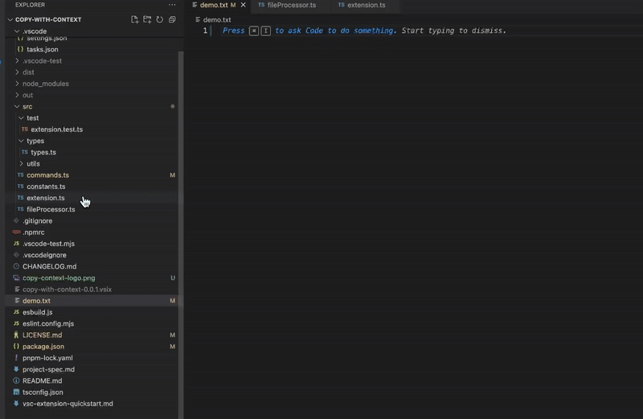

# Context Copy for VS Code

<!-- Optional: Add other badges like build status or license if applicable -->

Effortlessly copy the content of multiple files and entire folders from the VS Code Explorer to your clipboard, formatted perfectly to use as context for ChatGPT, Gemini, Grok, Ai Studio.

**Copy files in a way that llms can easily understand by appending filenames, and having clear file boundaries.**

## Copy Files and Folders

## Features
*   **Multi-Select Support:** Select any combination of files and folders.
*   **Recursive Folder Processing:** Copies content from all valid text files within selected folders and their subdirectories (up to a configurable depth).
*   **LLM-Friendly Formatting:** Output includes clear delimiters with relative paths:
    ````text
    ```[src/utils/fileUtils.ts]
    // Content of fileUtils.ts
    ```
    
    ```[src/command.ts]
    // Content of command.ts
    ```
    ````
*   **Smart Filtering:**
    *   Automatically skips (.env, images, archives, executables)
    *   Automatically **skips excessively large files** (default > 5MB, configurable in code).
*   **Avoid sensitive files:** Sensitive files such as .env are never copied to clipboard.

## Usage
1.  Select one or more files/folders in vscode menu explorer.
2.  Right-click on your selection.
3.  Choose "**Context Copy: llm friendly formatting**" from the menu.
4.  A brief success message will appear in the Status Bar (bottom left).
5.  Paste the content into your LLM prompt, text file, or anywhere else!
6.  images, videos, and binary files are skipped. 

### Notes:
- The following files/folders are always skipped, even if selected: ```` '.git',
    'node_modules',
    'out',
    'dist',
    '.env',
    '.vercel',
    '.next'````

## Known Issues

*   Currently, no known issues. Please report any bugs!

## Future Roadmap
 - Allow custom block lists for files/folders you do not want to  copy

## Contributing

Contributions, issues, and feature requests are welcome! Please feel free to open an issue or submit a pull request on Github: [project repository](https://github.com/Daniel-Ronson/copy-with-context.git) <!-- Replace with your actual repo URL -->.